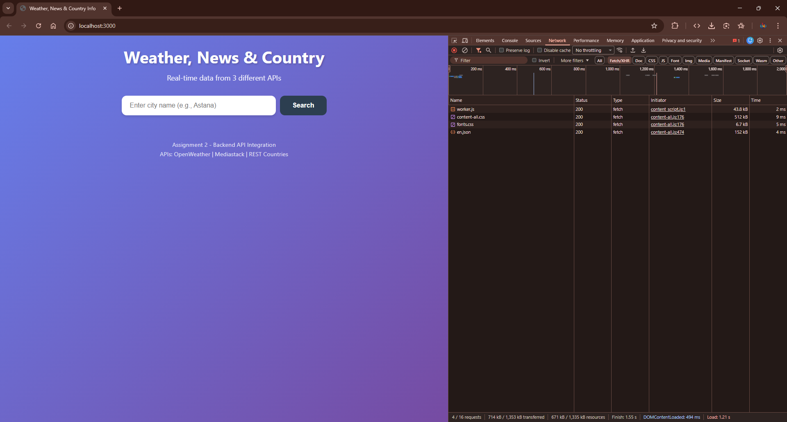
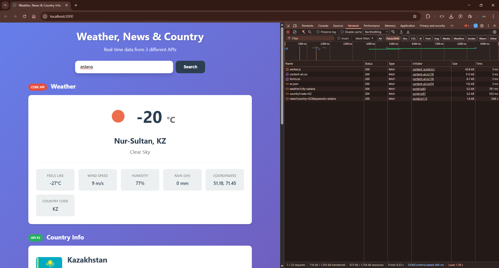
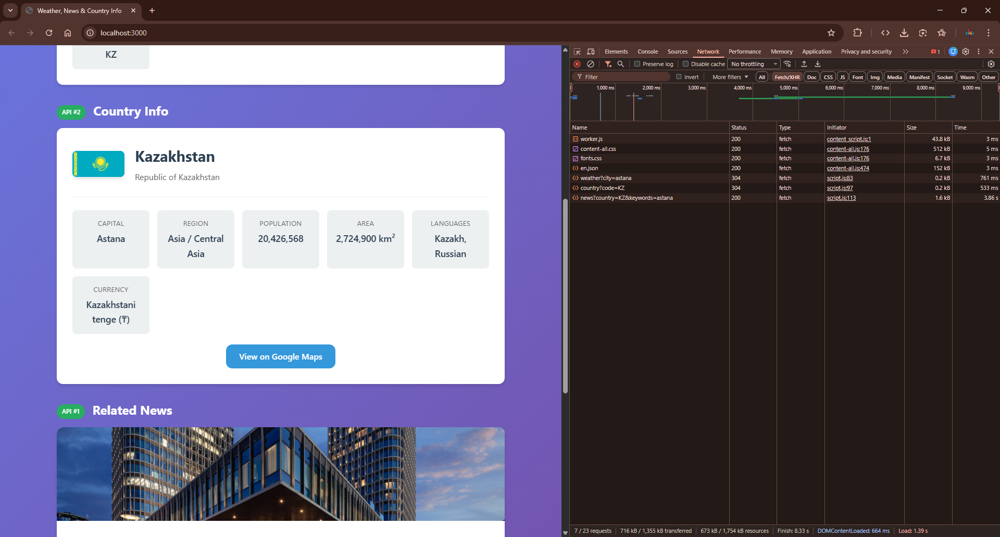
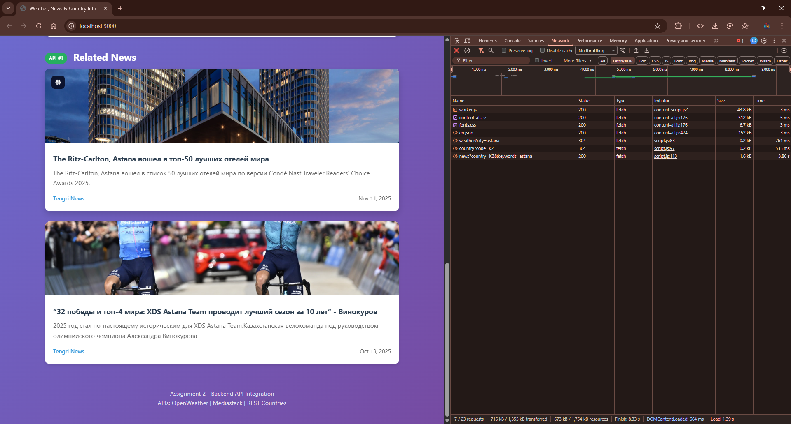
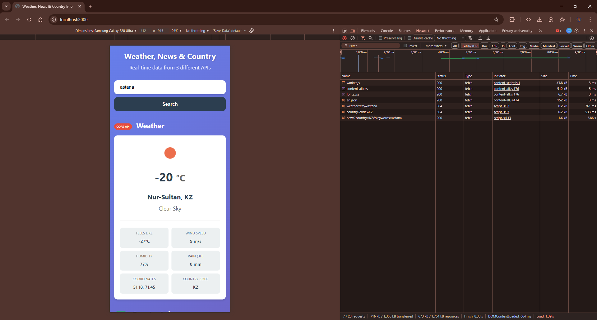
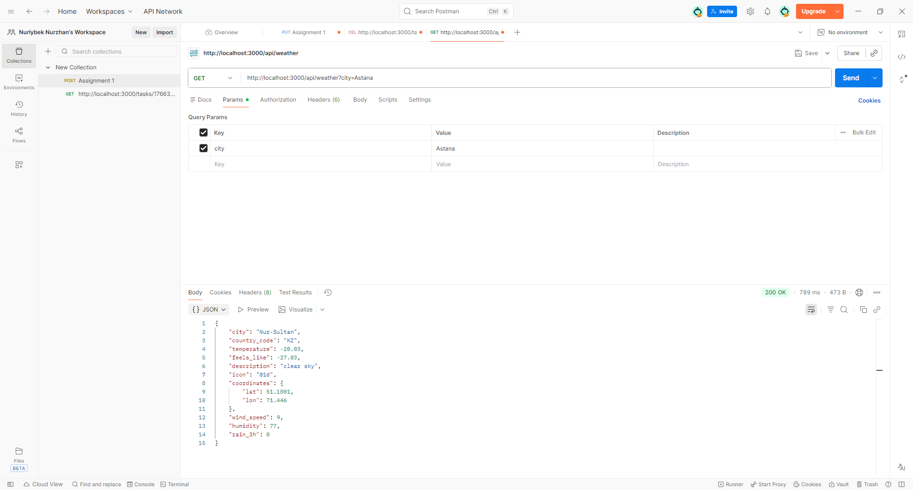
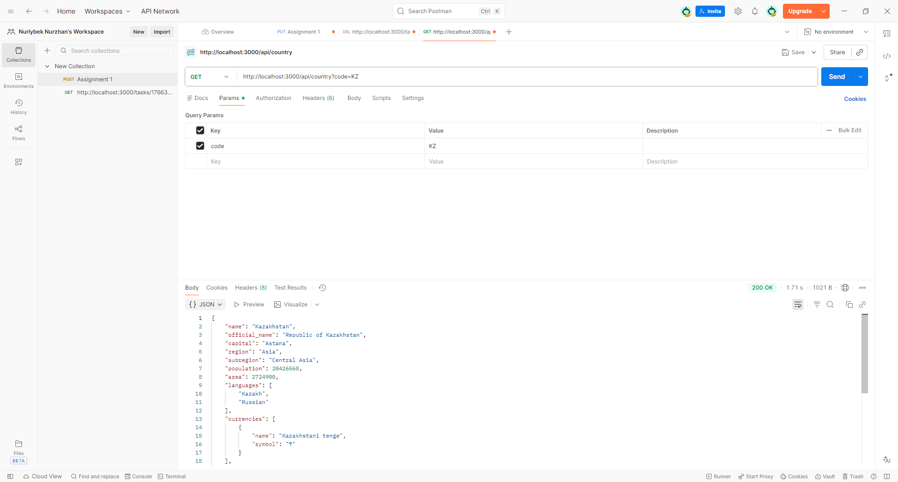
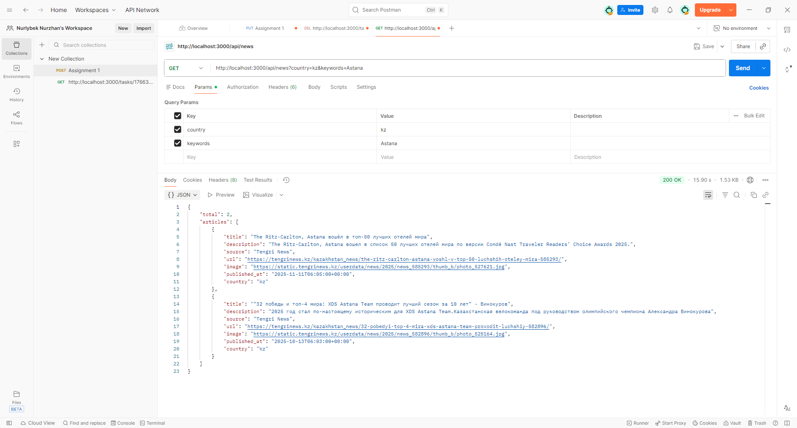

# Weather, News & Country Info Application

A full-stack web application demonstrating **server-side API integration**. Built with Node.js/Express backend and vanilla JavaScript frontend.

## Features

- **Real-time Weather Data** - Temperature, humidity, wind speed, coordinates, and more
- **Country Information** - Flag, population, languages, currency, capital city
- **Related News** - Latest news articles related to the searched location
- **Responsive Design** - Works on desktop, tablet, and mobile devices

## APIs Used

| # | API | Purpose | Documentation |
|---|-----|---------|---------------|
| Core | OpenWeather API | Weather data | [openweathermap.org](https://openweathermap.org/api) |
| Additional #1 | Mediastack API | News articles | [mediastack.com](https://mediastack.com/) |
| Additional #2 | REST Countries API | Country info | [restcountries.com](https://restcountries.com/) |

## Architecture

```
Browser (Frontend)
      |
      v
Express Server (Backend) -----> OpenWeather API
      |                  -----> Mediastack API
      v                  -----> REST Countries API
   Response
```

**Key Design Decision:** All API calls are made from the server-side, NOT directly from the browser. This approach:
- Hides API keys from users (security)
- Allows data processing before sending to client
- Enables rate limiting and caching
- Provides a single point of control

## Project Structure

```
project/
├── server.js          # Express server with API routes
├── .env               # Environment variables (API keys)
├── .gitignore         # Git ignore rules
├── package.json       # Dependencies and scripts
├── README.md          # This file
└── public/            # Frontend files
    ├── index.html     # Main HTML page
    ├── style.css      # Styles (responsive)
    └── script.js      # Client-side JavaScript
```

## Setup Instructions

### Prerequisites
- Node.js (v14 or higher)
- npm (Node Package Manager)

### Installation

1. **Clone the repository**
   ```bash
   git clone <repository-url>
   cd <project-folder>
   ```

2. **Install dependencies**
   ```bash
   npm install
   ```

3. **Configure environment variables**

   Create a `.env` file in the root directory:
   ```env
   OPENWEATHER_API_KEY=your_openweather_api_key
   MEDIASTACK_API_KEY=your_mediastack_api_key
   PORT=3000
   ```

4. **Start the server**
   ```bash
   npm start
   ```

   Or for development (auto-restart on changes):
   ```bash
   npm run dev
   ```

5. **Open in browser**
   ```
   http://localhost:3000
   ```

## API Endpoints

### GET /api/weather
Fetches weather data for a city.

**Query Parameters:**
- `city` (required) - City name

**Example:**
```
GET /api/weather?city=Astana
```

**Response:**
```json
{
  "city": "Astana",
  "country_code": "KZ",
  "temperature": -5,
  "feels_like": -10,
  "description": "clear sky",
  "icon": "01d",
  "coordinates": { "lat": 51.1801, "lon": 71.446 },
  "wind_speed": 3.5,
  "humidity": 80,
  "rain_3h": 0
}
```

### GET /api/news
Fetches news articles.

**Query Parameters:**
- `country` (optional) - Country code (e.g., "kz")
- `keywords` (optional) - Search keywords

**Example:**
```
GET /api/news?country=kz&keywords=Astana
```

### GET /api/country
Fetches country information.

**Query Parameters:**
- `code` (required) - ISO 3166-1 alpha-2 country code

**Example:**
```
GET /api/country?code=KZ
```

**Response:**
```json
{
  "name": "Kazakhstan",
  "official_name": "Republic of Kazakhstan",
  "capital": "Astana",
  "region": "Asia",
  "population": 18754440,
  "languages": ["Kazakh", "Russian"],
  "currencies": [{ "name": "Kazakhstani tenge", "symbol": "₸" }],
  "flag": "https://flagcdn.com/kz.svg"
}
```

## Technologies Used

- **Backend:** Node.js, Express.js v5.2.1
- **HTTP Client:** Axios v1.13.2
- **Environment:** dotenv v17.2.3
- **CORS:** cors v2.8.5
- **Dev Tools:** nodemon v3.1.11
- **Frontend:** HTML5, CSS3, JavaScript (ES6+)
- **Design:** CSS Grid, Flexbox, Media Queries

## Screenshots

### 1. Homepage - Initial State
Search interface before entering a city name.



---

### 2. Weather Data Display
After searching for "Astana" - shows temperature, feels like, wind speed, humidity, rain volume, coordinates, and country code.



---

### 3. Country Information Section
Displays country flag, official name, capital, region, population, area, languages, and currency from REST Countries API.



---

### 4. News Section
Related news articles fetched from Mediastack API based on the searched location.



---

### 5. Responsive Design - Mobile View
Application viewed on mobile device showing responsive layout.



---

### 6. Postman - Weather API Test
Testing `/api/weather?city=Astana` endpoint in Postman showing JSON response.



---

### 7. Postman - Country API Test
Testing `/api/country?code=KZ` endpoint in Postman.



---

### 8. Postman - News API Test
Testing `/api/news?country=kz&keywords=Astana` endpoint in Postman.



---

### Final Screenshot: Full Application View
Complete view of the application with all three API sections displayed (Weather, Country Info, News).


---

## Key Concepts for Defense

1. **Why server-side API calls?**
   - Security: API keys are hidden from users
   - Control: Can process/filter data before sending
   - Rate limiting: Single point to manage API limits

2. **What is middleware?**
   - Functions that run between request and response
   - Examples: `cors()`, `express.json()`, `express.static()`

3. **How does async/await work?**
   - Syntactic sugar for Promises
   - Makes asynchronous code look synchronous
   - `await` pauses execution until Promise resolves

4. **Error handling strategy:**
   - Try/catch blocks in async functions
   - Check response status codes
   - Return meaningful error messages to client

5. **What is CORS?**
   - Cross-Origin Resource Sharing
   - Security mechanism in browsers
   - `cors()` middleware allows cross-origin requests

6. **How does Express routing work?**
   - `app.get('/path', handler)` defines routes
   - Request object contains query params, body
   - Response object sends data back to client

## Author

Nurzhan - Web Technologies 2 Assignment

## License

ISC
